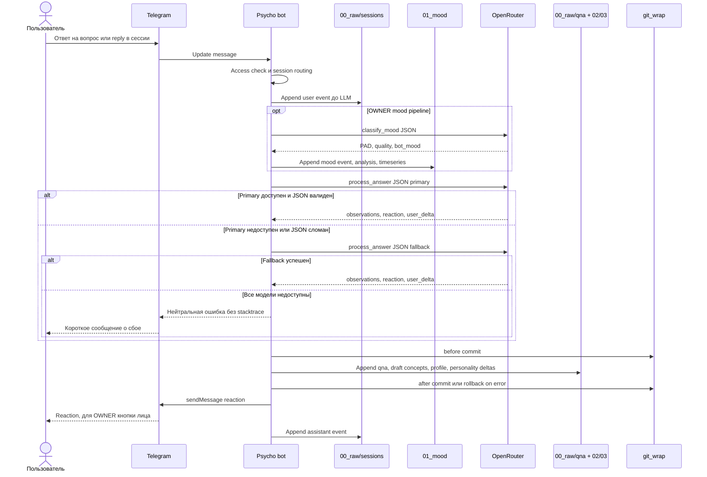

# Sequence одного ответа Psycho

## Цель

Показать последовательность одного пользовательского ответа: от Telegram update до raw-log, OpenRouter-вызова, сохранения артефактов и реакции бота.

## Участники

- Пользователь пишет ответ в Telegram.
- Telegram доставляет update и получает ответное сообщение.
- Psycho bot управляет доступом, сессией, LLM routing и сохранением.
- `00_raw/sessions` фиксирует полный transcript сессии.
- `01_mood` получает mood-события OWNER.
- OpenRouter выполняет primary/fallback LLM-вызовы.
- `00_raw/qna + 02/03` — укрупнённый блок stage-записей.
- `git_wrap` защищает запись before/after commit и rollback.

## Связи

Сначала бот пишет user event в raw-log, затем при необходимости классифицирует настроение, вызывает `process_answer`, сохраняет производные артефакты в git-транзакции и отправляет reaction в Telegram. После отправки reaction дописывается assistant event.

## Допущения и границы

Схема показывает один happy path и основные LLM-fallback ветки. Внутренние функции, конкретные классы и тексты prompt-файлов не раскрываются.

## Легенда

Actor: Telegram user; Bot: application orchestration; Raw: canonical session transcript; OpenRouter: primary/fallback LLM; Store: stage artifacts under git_wrap

## Mermaid source

