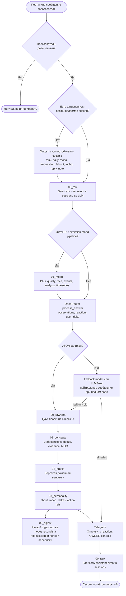

# Flowchart обработки сообщения Psycho

## Цель

Показать, как одно входящее сообщение пользователя проходит через обязательные этапы хранения и анализа: `00_raw`, `01_mood`, `02_concepts`, `02_profile`, `02_digest`, `03_personality`.

## Основные элементы

- Access check отделяет доверенных пользователей от остальных.
- Session routing определяет активную, возобновлённую или новую note-session.
- `00_raw/sessions` получает user event до любого LLM-вызова.
- `01_mood` работает только для OWNER и оставляет отдельные mood-артефакты.
- OpenRouter возвращает анализ, reaction и user_delta; при сбое используется fallback.
- `02_concepts`, `02_profile` и `03_personality` получают производные артефакты.
- `02_digest` не является live-записью каждого сообщения: digest собирается позже reconcista по refs.

## Связи

Happy path идёт сверху вниз: входящее сообщение → raw-log → mood → LLM → stage-артефакты → реакция → assistant event. Ошибочный путь LLM уходит через fallback; при полном сбое пользователь получает нейтральное сообщение, а граф не портится.

## Допущения и границы

Диаграмма показывает логический pipeline, а не отдельные Python-модули. Git-транзакции, MOC rebuild и кнопки OWNER сведены к укрупнённым блокам, чтобы сохранить читаемость.

## Легенда

Raw: immutable session capture before LLM; Mood: OWNER-only analysis artifacts; Drafts: concepts/profile/personality writes; Deferred: digest is built later by reconcista; Failure: fallback or neutral error

## Mermaid source

