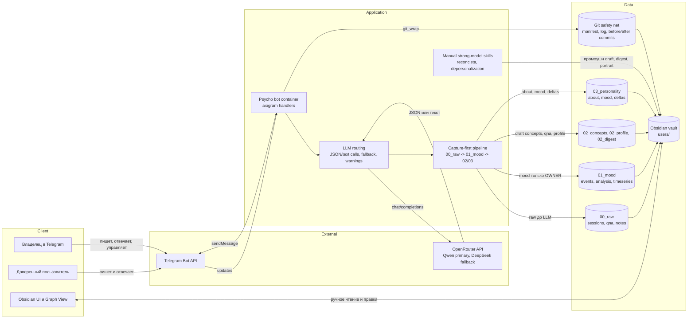

# Service-map Psycho

## Цель

Показать приложение Psycho целиком на уровне сервисов: кто взаимодействует с ботом, какие внешние системы участвуют, где живёт live-пайплайн и какие stage-артефакты остаются в Obsidian vault.

## Основные элементы

- Владелец и доверенные пользователи общаются с ботом через Telegram.
- `Psycho bot container` принимает updates, управляет сессиями, вызывает OpenRouter и пишет в vault.
- OpenRouter используется как внешний LLM-контур: primary Qwen и fallback DeepSeek.
- Obsidian vault хранит пользовательские stage-артефакты `00_raw`, `01_mood`, `02_*`, `03_personality`.
- Git safety net и manifest защищают данные от частичных записей и потери ручных правок.
- `reconcista` и `depersonalization` — ручные сильные проходы, которые выверяют граф, digest и портрет.

## Связи

Пользователь пишет в Telegram, Telegram доставляет update в bot container, бот сначала фиксирует raw-событие, затем обращается к OpenRouter и сохраняет производные артефакты. Obsidian читает тот же vault, а ручные скиллы работают поверх накопленных данных.

## Допущения и границы

Схема намеренно не показывает секреты, env-переменные, конкретные Docker-порты и внутренние функции модулей. Это container/service-level карта, не code-level view.

## Легенда

Client: Telegram/Obsidian users; Service: bot and live pipeline; Storage: vault stage artifacts and git safety net; External: Telegram and OpenRouter; Manual: strong-model skills

## Mermaid source

